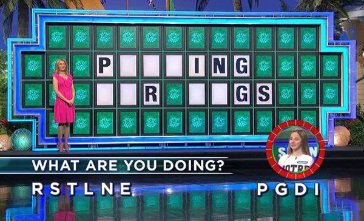

# wheel-of-fortune-problem


### Contrived scenario

Your grandma is in another room watching Wheel of Fortune. 

You hear the contestants call out letters, and hear the host's responses. 

It sounds like:
```
Contestant: "G!"

Announcer: "There are two G's!" *ding* *ding* 
```



But you can't see the game. And, maybe you misheard one of the letters or numbers. You're not sure.

Can you figure out the solution anyway?

Helpfully, you have a text file containing all possible Wheel of Fortune answers. 
You just need to find which of those answers is closest to the letter counts you heard.

### The actual programming problem

Given a long list of short phrases such as "A SPOOKY SPIDER" (see `wheel_of_fortune.txt`), put them all into some
data structure. 

Then, given a set of letter counts `{'a': 2, 'b': 1, c: 0, ...}`, find the Wheel of Fortune answer with the letter 
counts closest to what you heard.

### Solving

This is a nerd snipe. There's one solution in `main.py`, but there are many good ways to attack the problem. Have fun!